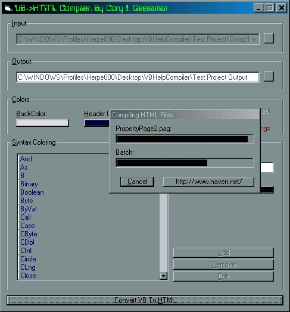



## VB\-\-\>HTML Compiler

### Description

This app changes a .vbg, .vbp, .frm, .bas, .cls, .ctl, or .pag file and all the files that it contains into a group of HTML pages. This can be very useful if you need to document something, or just to put your vb files on your website w/out people having to dl them. If you know anyway to parse the strings faster please let me know. Also if you like this PLZ VOTE.
 
### More Info
 
You will need vb6 to run this, or you will need a replacement for the Split/Replace functions; i put a replacement for the Replace function in there, it is commented out, but i did not feel like writing the Split function, i'm sure u can find it in no time on psc though.

This program does have a single error that i know of but cannot find it's cause; if you look at the test project's compiled html files you can see that sometimes it will make the Else statement a comment, and it will always do it to End Type and End Enum statements, if you have any idea how to fix this please tell me.

             |
---                |---
**Submitted On**   |2001-05-20 13:50:58
**By**             |[Cory J\. Geesaman](https://github.com/Planet-Source-Code/PSCIndex/blob/master/ByAuthor/cory-j-geesaman.md)
**Level**          |Intermediate
**User Rating**    |3.8 (30 globes from 8 users)
**Compatibility**  |VB 5\.0, VB 6\.0
**Category**       |[Complete Applications](https://github.com/Planet-Source-Code/PSCIndex/blob/master/ByCategory/complete-applications__1-27.md)
**World**          |[Visual Basic](https://github.com/Planet-Source-Code/PSCIndex/blob/master/ByWorld/visual-basic.md)
**Archive File**   |[VB\-\-\_HTML 198205202001\.zip](https://github.com/Planet-Source-Code/cory-j-geesaman-vb-html-compiler__1-23304/archive/master.zip)

